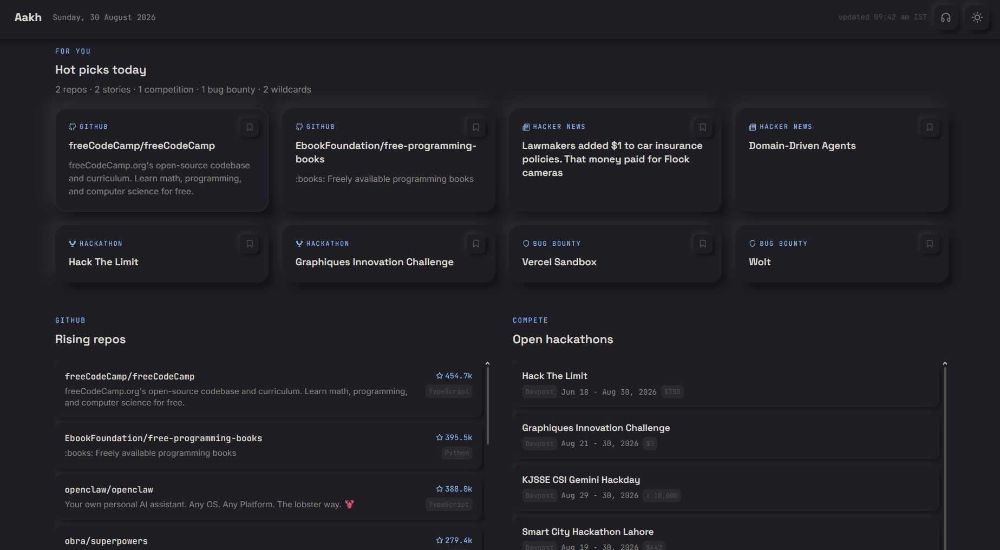
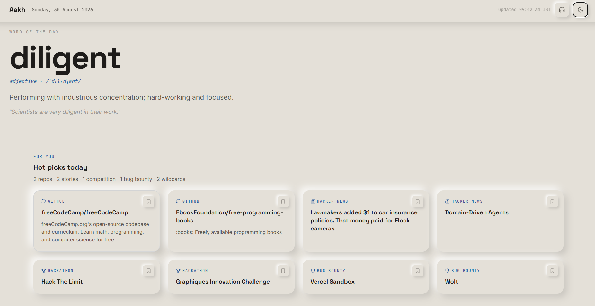
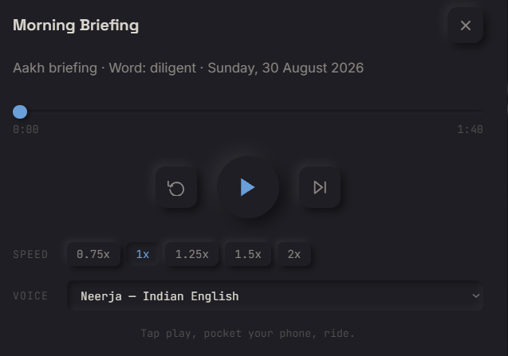

# Aakh

**v1.3.1** — [Live](https://lakshyav-rshney.github.io/aakh/)

A self-updating morning dashboard. Pulls trending repos, open hackathons, bug bounties, and developer news every night. Ready before you wake up.



---

## Changelog

### v1.3.1 (Latest)
- **UI Polish:** Replaced dynamically loaded Lucide icons in the footer with embedded inline SVGs to ensure flawless, immediate rendering and added developer credits.

### v1.3.0
- **Speed Optimization:** Migrated Python scrapers to run concurrently in GitHub Actions and implemented `pip` caching, reducing execution time from ~65s to ~30s.
- **Strategic Cron Timing:** Shifted GitHub Actions cron to `00:10 UTC` to dodge the notorious midnight server stampede and ensure smooth, unthrottled runs.
- **Resilience:** Built a bulletproof JSON loader in `build_dashboard_data.py` to gracefully handle and reset corrupt JSON files caused by Git merge conflicts.
- **Audio Revival:** Fixed dynamic path routing for `edge-tts` ensuring the daily TTS generation runs flawlessly.

### v1.2.1
- **Data Pipeline:** Migrated Bug Bounty scraping to `arkadiyt/bounty-targets-data`, tracking 600+ active programs across HackerOne, Bugcrowd, and Intigriti.
- **AI Stability:** Implemented a resilient local-data fallback mechanism for the Groq LLM to ensure the dashboard always populates exactly 8 hot picks even if the model hallucinates or degrades.
- **Codebase:** Removed legacy UI features, stripped unused CSS/JS parameters, and resolved Windows Unicode encoding crashes in the GitHub trending fetcher.

---

## What it shows

- **Word of the day** — rotating curated vocabulary, definition and example
- **Hot picks for you** — 8 cards ranked by an LLM: 2 repos, 2 HN stories, 1 hackathon, 1 bug bounty, 2 wildcards
- **Rising repos** — trending GitHub repositories across Python, JS, TS, Rust, Go, C, C++, Java, Shell, Kotlin, Swift
- **Open hackathons** — Unstop, Devpost, MLH with deadlines and closing-soon badges
- **Bug bounty programs** — open programs pulled directly from real-time open-source tracker datasets
- **Hacker News** — keyword-filtered top stories
- **Audio briefing** — 3-minute spoken summary, 4 voice options, playback speed control

---

## How it works

```
GitHub Actions (cron: 00:10 UTC) + Pip Caching
|
|- fetch_github_trending.py     & \
|- fetch_competitions.py        & | (Concurrent
|- fetch_bug_bounties.py        & |  Scraping)
|- fetch_hackernews_rss.py      & |
|- fetch_word_of_day.py         & /
|- wait
|
|- rank_hot_topics.py           Groq qwen/qwen3.6-27b        -> data/hot_topics.json
|- build_dashboard_data.py      merge static JSON            -> docs/data/data.json
|- generate_audio.py            edge-tts x4 voices           -> docs/audio/*.mp3
|
git commit + push -> GitHub Pages redeploys automatically
```

Each script handles failures and corrupt JSON independently. One broken source does not affect the others.

---

## Stack

| Layer        | Tool                                    |
|--------------|-----------------------------------------|
| Scheduling   | GitHub Actions                          |
| Hosting      | GitHub Pages                            |
| Repo data    | GitHub REST API                         |
| Competitions | Unstop, Devpost, MLH (scraped)          |
| Bug bounties | arkadiyt/bounty-targets-data            |
| News         | HNRSS                                   |
| Vocabulary   | Free Dictionary API                     |
| LLM ranking  | Groq API (qwen/qwen3.6-27b)             |
| TTS          | edge-tts (Microsoft Edge neural voices) |
| Icons        | Lucide                                  |
| Frontend     | HTML, CSS, vanilla JS — no framework    |
| Storage      | Flat JSON committed to repo             |
| Scripts      | Python                                  |

No database. No server. No paid infrastructure.

---

## Frontend features

**Word of the day** — hero section, changes daily, definition + example.


**Theme toggle** — dark (default) and light, saved to localStorage.

**Hot picks** — 8 cards with guaranteed diversity: 2 repos, 2 HN stories, 1 hackathon, 1 bug bounty, plus 2 wildcards from whichever category has the strongest signal that day.

**Pinning** — bookmark any card. Pinned items appear in a bar at the top and survive nightly refreshes until you remove them.

**Audio popup** — 4 pre-generated MP3s (Neerja, Prabhat, Guy, Ryan). Controls: play/pause, restart, skip 15s, seek bar, playback speed, voice selector.


**Scrollable sections** — Rising Repos, Open Hackathons, and Bug Bounties each have their own scroll container.

---

## Configuration

Edit `config/sources.yaml` — no code changes needed.

```yaml
competitions:
  sources:
    - name: MLH
      mlh_year: 2026   # update every January

audio:
  voices:
    - name: "Neerja (Indian English)"
      voice: "en-IN-NeerjaNeural"
      file: "morning_neerja.mp3"
```

---

## Running locally

```bash
git clone https://github.com/lakshyaV-rshney/aakh.git
cd aakh
pip install -r requirements.txt
cp .env.example .env   # add GH_TOKEN and GROQ_API_KEY
```

### Option A: One-click build (Windows)

Double-click `build.bat` or run from PowerShell:

```powershell
.\build.bat
```

### Option B: Run scripts individually

```powershell
python scripts/fetch_github_trending.py
python scripts/fetch_competitions.py
python scripts/fetch_bug_bounties.py
python scripts/fetch_hackernews_rss.py
python scripts/fetch_word_of_day.py
python scripts/rank_hot_topics.py
python scripts/build_dashboard_data.py
python scripts/generate_audio.py
```

### Preview the dashboard

```powershell
cd docs
python -m http.server 8000
# open http://localhost:8000 in your browser
```

---

## Hardcoded assumptions to review

| Item | Location | Action needed |
|---|---|---|
| MLH season year | `config/sources.yaml` -> `mlh_year` | Update every January |
| Groq model | `config/sources.yaml` -> `groq.model` | Update if Groq deprecates the model |
| edge-tts voices | `config/sources.yaml` -> `audio.voices` | Update if Microsoft retires a voice |

---

[Create your own dashboard here.](https://github.com/lakshyaV-rshney/aakh)

Developed by **Lakshya Varshney**  
🔗 [GitHub](https://github.com/lakshyaV-rshney) | 🔗 [LinkedIn](https://www.linkedin.com/in/-lakshya-varshney/)
